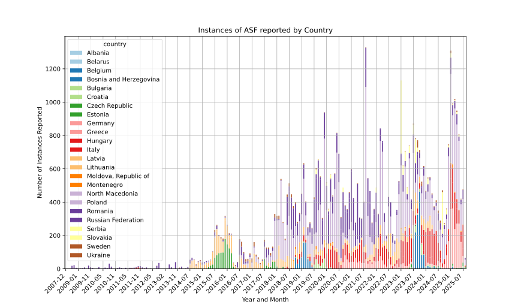
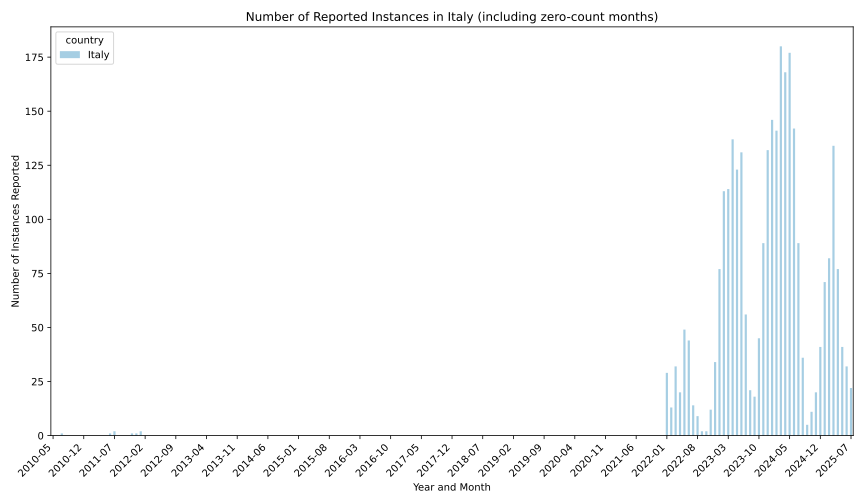
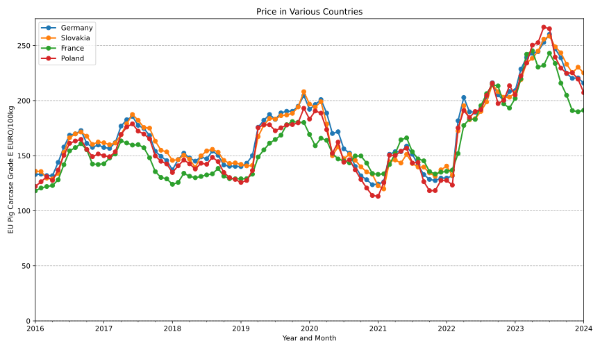
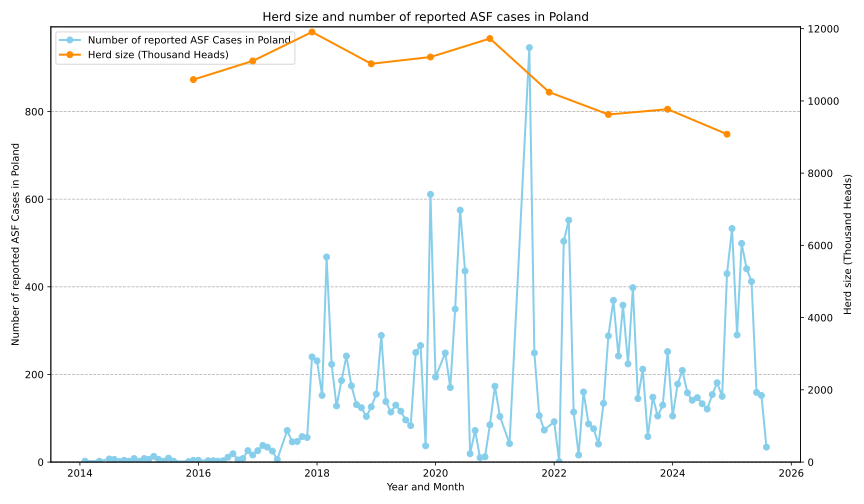

## Investigation into ASF and it's impact on herd sizes and pork prices

To run the code to generate any of the data refered to below, open `ASF_investigation.ipynb` in jupyter-notebook.

### Part 1: Investigating reported instances of ASF

**1. Data source**: 

- Food and Agriculture Organisation of the United Nations: https://europe-west1-fao-empresi.cloudfunctions.net/getDiseaseEvents?disease_name=african_swine_fever&animal_type=all&diagnosis_status=confirmed&end_date=2025-08-07&start_date=2000-05-07
- Link for the general API of the Foor and Agriculture Organization of the United Nations: https://empres-i.apps.fao.org/general

**2. Findings**:

* Reported numbers from most regions appear unreliable, Europe and South East Asia are the exceptions. 

**3. Plots**:

### Part 2: How useful can this data be in anticipating a Chinese ban on pork imports?

Why China? China is of the world's largest importers of pork. 

**1. Italy:**
China re-approved pork imports from Italy in September 2016 after a 17 year ban In this data we later find the earliest case reported to be the **5th of January 2022**.
With the Chinese ban being announced on January 26th 2022. It would have been possible to anticipate the ban.

**2. Germany:** 
The first reported case found in the dataset for Germany was **9th of September 2020** for a case observed **7th of September**,
China banned imports of pork from Germany on September 14th 2020. It would have been possible to anticipate such ban.

**3. Indonesia:**
TODO:

**4. Further findings:** despite the findings suggesting that following the data at the Food and Agriculture Organisation of the United Nations would be enough to get ahead
of national import bans from China, there will always be a lag between the observed date and the reported date, but also between the reported date and the published date.
The place best measure to get the most up to date data on new observed instances of ASF is the [World Organisation for Animal Health](https://www.woah.org/en/home/), more specifically to sign up to 
their [distribution list](https://www.woah.org/en/what-we-do/animal-health-and-welfare/disease-data-collection/info-list/).

### Part 3: Did ASF impact the price of pork in Europe (Cracase Grade E) ?

**1. Data source:**

- For porc prices across europe, data was taken from the European Comission pigmeat statistics: https://agriculture.ec.europa.eu/data-and-analysis/markets/overviews/market-observatories/meat/pigmeat-statistics_en
- An alternative source for the same data is: https://ahdb.org.uk/pork/eu-deadweight-pig-prices

**2. Observations:**

- Significant volatility in the pork prices across different European countries.
- **Calculate the correlation between n cases and price**
- Reported ASF do not appear to be a good predictor of pork price on a monthly/yearly scale though might be over shorter time horizon.

**3. Further Comments:**
Further research suggested that many other factors were impacting pork price in the years of 2016 to 2024 other than
ASF, including amongst other things the rising cost of energy and feed. 

### Part 4: Could ASF have an influence on herd price in Europe?

**1. Data source:**

- Retrieved data on herd sizes from the European Comission statistics database: https://ec.europa.eu/eurostat/data/database?node_code=tag00018
- Ideally I would have found the data for animal code A3200 (Breeding Sows) which are a good forward indicator of future herd size, 
unfortunately I could only find data for A3100.

**2. Observations:**
- Herd size in Poland appears uncorrelated with the number of cases of ASF.

